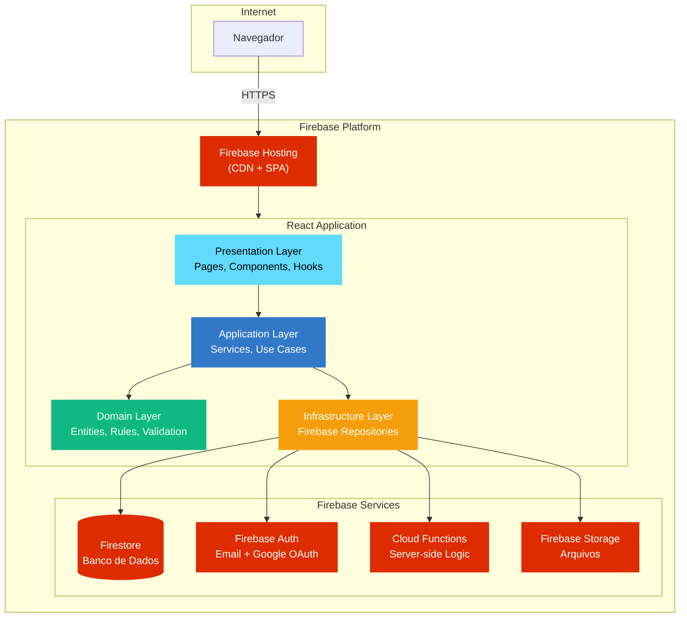
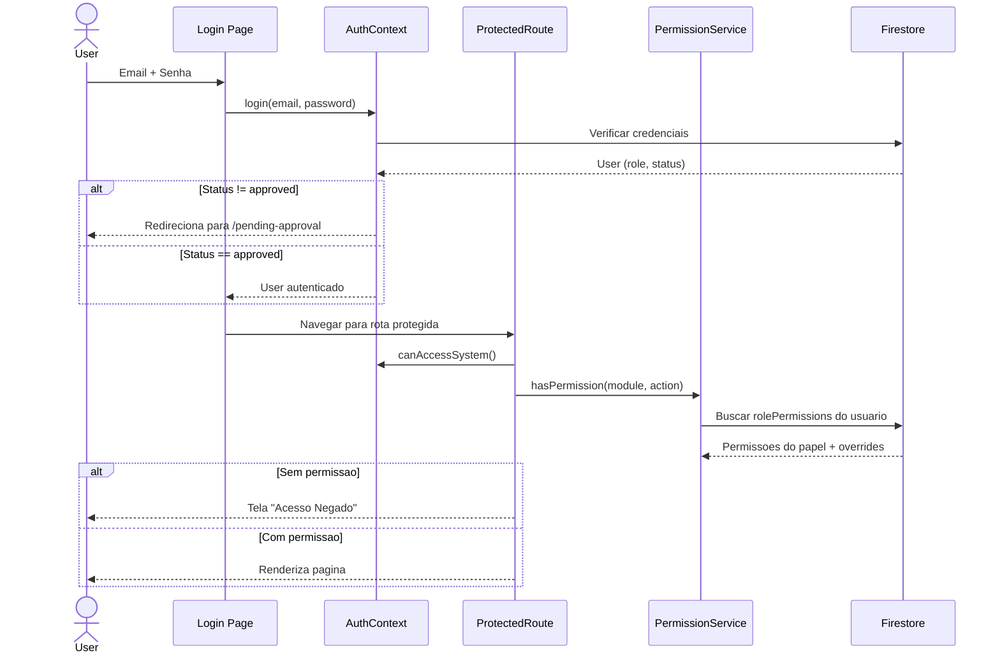

<div align="center">

# Church Management

**Sistema completo de gestao para igrejas e ONGs — membros, financas e assistencia social em um so lugar.**

[](https://react.dev)
[](https://typescriptlang.org)
[](https://firebase.google.com)
[](https://tailwindcss.com)
[](#)

[Funcionalidades](#-funcionalidades) · [Arquitetura](#-arquitetura) · [Fluxo de Permissoes](#-fluxo-de-permissoes) · [Quick Start](#-quick-start) · [Tech Stack](#-tech-stack)

</div>

---

## O que e o Church Management?

Church Management e um **sistema web completo** para administracao de igrejas e ONGs. Centraliza o gerenciamento de membros, eventos, financas, assistencia social, conteudo e permissoes em uma unica plataforma. Construido com **React 19**, **TypeScript** e **Firebase**, seguindo **Clean Architecture** e **Domain-Driven Design**.

Funciona tanto para **igrejas** quanto para **ONGs** — basta escolher o tipo de organizacao no setup inicial. Cada tipo habilita modulos especificos: igrejas tem dizimos, devocionais e batismo; ONGs tem voluntarios, atividades e financas separadas.

---

## Funcionalidades

| Categoria | O que voce tem |
|---|---|
| **Membros** | Cadastro completo, historico de batismo, status, exportacao CSV/XLS/DOCX |
| **Eventos** | Agendamento, calendario, check-in, inscricao publica anonima |
| **Financas Igreja** | Receitas, despesas, doacoes, dizimos, ofertas, categorias, relatorios |
| **Financas ONG** | Sistema financeiro separado com categorias e relatorios proprios |
| **Caixinhas** | Departamentos financeiros com depositos, saques e saldo independente |
| **Assistencia Social** | Cadastro de assistidos, familiares, fichas de acompanhamento, prontuarios |
| **Agendamentos** | Marcacao de consultas com profissionais, horarios configurados por profissional |
| **Profissionais** | Psicologos, advogados, nutricionistas, fisioterapeutas — com horarios e especialidades |
| **Blog** | Publicacao de artigos com editor rich-text |
| **Devocionais** | Devocionais diarios com versiculo do dia automatico |
| **Transmissoes** | Gerenciamento de lives e transmissoes |
| **Projetos** | Acompanhamento de projetos sociais |
| **Forum** | Topicos de discussao com prioridade e tags |
| **Pedidos de Oracao** | Membros podem enviar e acompanhar pedidos |
| **Visitantes** | Registro de visitantes com historico de visitas |
| **Voluntarios (ONG)** | Cadastro, habilidades, disponibilidade, horas trabalhadas |
| **Permissoes** | RBAC granular — 6 papeis, 26 modulos, 5 acoes por modulo |
| **Logs** | Auditoria completa de operacoes do sistema |
| **Backups** | Exportacao de dados via interface admin |
| **Notificacoes** | Sistema de notificacoes internas |
| **Pagina Publica** | Home customizavel, contato, doacoes, eventos publicos |
| **Multi-tema** | Cores primaria/secundaria configuraveis por organizacao |

---

## Arquitetura



### Como as camadas se conectam

| Camada | Responsabilidade | Tecnologia |
|---|---|---|
| **Presentation** | Paginas, componentes, hooks, contextos, roteamento | React 19 + Tailwind CSS |
| **Application** | Servicos, casos de uso, orquestracao de fluxos | TypeScript Services |
| **Domain** | Entidades, regras de negocio, validacoes, interfaces | TypeScript Entities |
| **Infrastructure** | Repositorios Firebase, conversao de dados, APIs externas | Firestore SDK |

O projeto segue **Clean Architecture** com **inversao de dependencia** — camadas internas nao conhecem as externas. Cada modulo tem suas proprias entidades, servicos e repositorios.

---

## Fluxo de Permissoes



### Papeis e Permissoes

| Papel | Acesso | Descricao |
|---|---|---|
| **Admin** | Total | Acesso completo a todos os modulos e configuracoes |
| **Secretary** | Gerencial | Membros, eventos, blog, visitantes, relatorios |
| **Professional** | Assistencia | Dashboard profissional, consultas, fichas, prontuarios |
| **Finance** | Financeiro | Transacoes, doacoes, relatorios financeiros |
| **Leader** | Lideranca | Eventos, projetos, membros (visualizacao) |
| **Member** | Basico | Eventos, blog, forum, devocionais (visualizacao) |

Papeis customizados podem ser criados pelo admin com permissoes granulares por modulo e acao.

---

## Modulos

```
src/modules/
├── church-management/          # Membros, eventos, departamentos, oracoes, visitantes, devocionais
├── content-management/         # Blog, forum, lives, projetos, home builder, paginas publicas
├── assistance/                 # Assistidos, agendamentos, profissionais, fichas, prontuarios
├── financial/                  # Financas igreja + financas ONG (sistemas independentes)
├── user-management/            # Autenticacao, permissoes, papeis
├── ong-management/             # Configuracoes e voluntarios de ONG
├── shared-kernel/              # DI container, event bus, logging, migracoes, module registry
└── analytics/                  # Tracking e metricas
```

| Modulo | Descricao |
|---|---|
| **church-management** | Core da igreja — membros, eventos, departamentos, oracoes, visitantes, devocionais |
| **content-management** | CMS — blog, forum, transmissoes, projetos, home builder, paginas publicas |
| **assistance** | Assistencia social — assistidos, agendamentos, profissionais, anamneses psicologicas |
| **financial** | Dois sistemas financeiros independentes (igreja + ONG) com caixinhas departamentais |
| **user-management** | Auth (email + Google), permissoes RBAC, papeis customizados, aprovacao de usuarios |
| **ong-management** | Configuracoes de ONG, voluntarios, atividades |
| **shared-kernel** | Infraestrutura compartilhada — DI, event bus, logging estruturado, migracoes |
| **analytics** | Tracking de uso e metricas |

---

## Getting Started

### Pre-requisitos

| Requisito | Versao |
|---|---|
| Node.js | 18+ |
| npm | 9+ |
| Firebase CLI | Instalado globalmente |
| Projeto Firebase | Configurado com Firestore, Auth, Storage |

### Desenvolvimento

```bash
# Clone
git clone https://github.com/JohnPitter/church-management.git
cd church-management

# Instale as dependencias
npm install

# Configure o Firebase
cp .env.example .env.local
# Edite .env.local com suas credenciais Firebase

# Inicie o servidor de desenvolvimento
npm start

# Acesse: http://localhost:3000
```

### Producao

```bash
# Build de producao
npm run build

# Deploy para Firebase (hosting + functions)
npm run deploy
```

---

## Tech Stack

<div align="center">

| Camada | Tecnologia |
|:---:|:---:|
| **Frontend** | React 19, TypeScript 4.9, Tailwind CSS 3, React Router v6 |
| **Estado** | React Context + Custom Hooks |
| **Backend** | Firebase Cloud Functions |
| **Banco de Dados** | Cloud Firestore (NoSQL) |
| **Autenticacao** | Firebase Auth (email/senha + Google OAuth) |
| **Storage** | Firebase Storage |
| **Hosting** | Firebase Hosting (CDN) |
| **Testes** | Jest + React Testing Library |
| **CI/CD** | GitHub Actions |

</div>

---

## Estrutura do Projeto

```
church-management/
  package.json
  tsconfig.json
  firebase.json
  .github/workflows/              # CI/CD pipeline

  functions/                      # Firebase Cloud Functions
    src/index.ts                  # createUserAccount, deleteUserAccount

  src/
    modules/                      # Modulos DDD (dominio + aplicacao + infraestrutura)
      church-management/          # Membros, eventos, departamentos, visitantes, devocionais
        members/                  #   Cadastro, batismo, status, exportacao
        events/                   #   Agendamento, calendario, check-in
        departments/              #   Caixinhas financeiras
        prayer-requests/          #   Pedidos de oracao
        visitors/                 #   Registro de visitantes
        devotionals/              #   Devocionais, versiculo do dia

      content-management/         # Blog, forum, lives, projetos, home builder
        blog/                     #   Artigos com rich-text
        forum/                    #   Topicos, prioridade, tags
        live-streaming/           #   Gerenciamento de transmissoes
        projects/                 #   Projetos sociais
        home-builder/             #   Customizacao da pagina publica
        public-pages/             #   Paginas publicas configuraveis

      assistance/                 # Sistema de assistencia social
        assistencia/              #   Entidades, servicos e repos de assistencia
        assistidos/               #   Cadastro e gestao de assistidos
        agendamento/              #   Agendamento de consultas com profissionais
        professional/             #   Gestao de profissionais
        help-requests/            #   Pedidos de ajuda

      financial/                  # Sistemas financeiros
        church-finance/           #   Financas da igreja (receitas, despesas, doacoes)
        ong-finance/              #   Financas da ONG (sistema independente)

      user-management/            # Auth + permissoes
        auth/                     #   Login, registro, Google OAuth
        permissions/              #   RBAC: 6 papeis, 26 modulos, 5 acoes, papeis customizados

      ong-management/             # ONG
        settings/                 #   Configuracoes, voluntarios, atividades

      shared-kernel/              # Infraestrutura compartilhada
        di/                       #   Dependency injection container
        event-bus/                #   Comunicacao entre modulos
        logging/                  #   Logging estruturado (info, warn, error, debug)
        migration/                #   Migracoes de dados
        module-registry/          #   Registro e inicializacao de modulos

      analytics/                  # Tracking

    presentation/                 # Camada de apresentacao
      pages/                      # Paginas (admin, publica, profissional, configuracoes)
      components/                 # Componentes (modais, charts, layout, forms, guards)
      contexts/                   # AuthContext, SettingsContext, PermissionsContext
      hooks/                      # useAuth, usePermissions, useEvents, useTheme, useAdminCheck
      utils/                      # dateUtils, prontuarioExport

    config/                       # Firebase config
    domain/                       # Entidades globais (User, Permission)
    utils/                        # Utilitarios compartilhados (dateUtils)
    services/                     # Servicos globais (logging)

  docs/                           # Documentacao tecnica
```

---

## Variaveis de Ambiente

| Variavel | Descricao | Obrigatoria |
|---|---|---|
| `REACT_APP_FIREBASE_API_KEY` | Chave da API do Firebase | Sim |
| `REACT_APP_FIREBASE_AUTH_DOMAIN` | Dominio de autenticacao | Sim |
| `REACT_APP_FIREBASE_PROJECT_ID` | ID do projeto Firebase | Sim |
| `REACT_APP_FIREBASE_STORAGE_BUCKET` | Bucket do Storage | Sim |
| `REACT_APP_FIREBASE_MESSAGING_SENDER_ID` | ID do sender FCM | Sim |
| `REACT_APP_FIREBASE_APP_ID` | App ID do Firebase | Sim |

---

## Comandos

| Comando | Descricao |
|---|---|
| `npm start` | Servidor de desenvolvimento (localhost:3000) |
| `npm test` | Testes em watch mode (Jest) |
| `npm run build` | Build de producao |
| `npm run lint` | Verificacao ESLint |
| `npm run lint:fix` | Correcao automatica de lint |
| `npm run typecheck` | Verificacao de tipos TypeScript |
| `npm run deploy` | Deploy completo para Firebase |
| `npm run setup:indexes` | Configurar indices do Firestore |
| `npm run migrate:permissions` | Migrar sistema de permissoes |

---

## Firestore Collections

| Collection | Proposito |
|---|---|
| `users` | Contas de usuario com role, status, permissoes, OAuth data |
| `settings` | Configuracoes da organizacao (cores, logo, PIX, pagamentos) |
| `members` | Membros da igreja com batismo, status, historico |
| `events` | Eventos com calendario, check-in, inscricoes |
| `departments` | Caixinhas financeiras com saldo, depositos, saques |
| `transactions` | Transacoes financeiras da igreja (receitas + despesas) |
| `ong_transactions` | Transacoes financeiras da ONG (sistema separado) |
| `donations` | Doacoes (dizimos, ofertas, missoes) |
| `categories` | Categorias financeiras (receita/despesa) |
| `assistidos` | Pessoas assistidas com familiares e fichas |
| `agendamentos` | Agendamentos de consultas com profissionais |
| `profissionais` | Profissionais de assistencia (psicologos, advogados, etc.) |
| `voluntarios` | Voluntarios da ONG com habilidades e disponibilidade |
| `blog_posts` | Artigos do blog |
| `devotionals` | Devocionais diarios |
| `prayer_requests` | Pedidos de oracao |
| `visitors` | Visitantes com historico de visitas |
| `forum_topics` | Topicos do forum |
| `notifications` | Notificacoes internas |
| `logs` | Auditoria completa de operacoes |
| `rolePermissions` | Permissoes customizadas por papel |

---

## Seguranca

| Protecao | Implementacao |
|---|---|
| **Autenticacao** | Firebase Auth com email/senha + Google OAuth |
| **Autorizacao** | RBAC granular — 6 papeis + papeis customizados, 26 modulos, 5 acoes |
| **Rota Protegida** | ProtectedRoute verifica auth + status approved + permissao especifica |
| **XSS** | React built-in escaping, conteudo sanitizado antes de renderizar |
| **Firestore Rules** | Regras de seguranca no servidor limitando acesso por usuario |
| **Cloud Functions** | Operacoes sensiveis (criar/deletar usuario) executam server-side |
| **Dados Sensiveis** | Tokens e credenciais nunca expostos na API de resposta |
| **Rate Limiting** | Protecao contra brute force em endpoints de autenticacao |

---

## Documentacao

| Documento | Descricao |
|---|---|
| [Arquitetura](docs/architecture.md) | Clean Architecture, DDD, camadas e padroes |
| [Modulos](docs/modules.md) | 8 modulos DDD com servicos e entidades |
| [CI/CD Pipeline](docs/ci-cd.md) | GitHub Actions, jobs e deploy automatico |
| [Firebase](docs/firebase.md) | Firestore, Cloud Functions, Storage e regras |
| [Permissoes](docs/permissions.md) | RBAC com 6 papeis, 26 modulos e 5 acoes |
| [Desenvolvimento](docs/development.md) | Setup, workflow, padroes e troubleshooting |

---

<div align="center">

**Built with React and TypeScript by [@JohnPitter](https://github.com/JohnPitter)**

</div>
